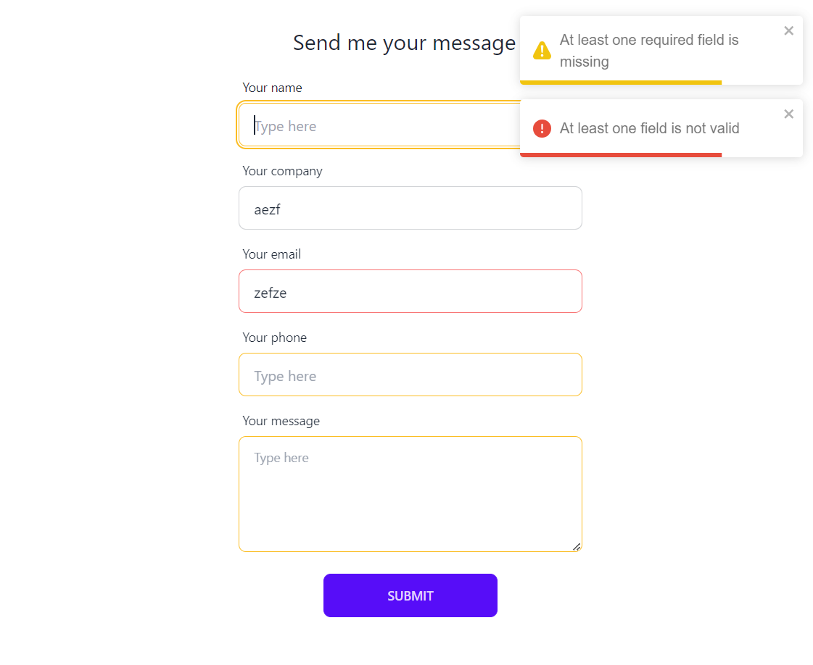

# React form

Project currently in development.

<p align="center">
  
</p>

## Features

To fullfill

## Project

React powered by [Vite](https://vitejs.dev/)

With :

- [TailwindCss](https://tailwindcss.com/) & [DaisyUI](https://daisyui.com/) for styling
- [@tanstack/react-query](https://tanstack.com/query/v3/)
- [react-hook-form - useForm](https://react-hook-form.com/)

## Use it !

Download zip or clone repo and...

```bash
  yarn
  yarn run dev
```

Happy coding ;)
