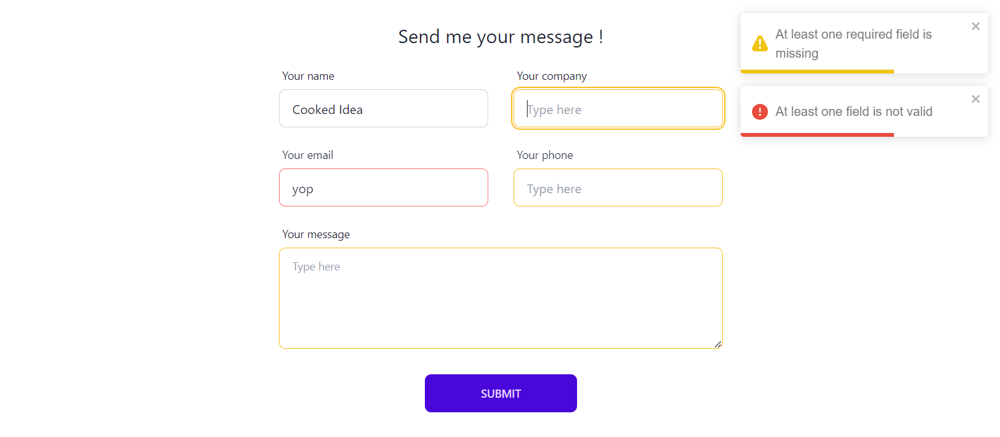

# React form

A responsive form using useForm hook and react-query.

<p align="center">
  
</p>

## Features

- Inform user : if there is errors in inputs fulfillment, if submission is successful, if submission is not successful
- All inputs data from an array

To test it, set VITE_IS_TEST as true in .env

For production, change api url to yours in .env VITE_API_URL='your-api-url' and in utils/index.jsx → usePostForm hook → customFetch.post('/your-api-route', mailBody)

## Project

React powered by [Vite](https://vitejs.dev/)

With :

- [@tanstack/react-query](https://tanstack.com/query/v3/)
- [react-hook-form - useForm](https://react-hook-form.com/)
- [react-toastify](react-toastify) for beautiful toaster
- [miragejs](https://miragejs.com) to mockup server response
- [TailwindCss](https://tailwindcss.com/) & [DaisyUI](https://daisyui.com/) for styling

## Use it !

Download zip or clone repo and...

```bash
  yarn
  yarn run dev
```

Happy coding ;)
